# WC DataVis — React

A React + Tailwind CSS rewrite of the [wcdatavis](wcdatavis/) data visualization library. Replaces all legacy jQuery UI widgets with [`@mieweb/ui`](https://ui.mieweb.org) components while retaining the battle-tested JavaScript data-processing engine unchanged.

**wcdatavis** is a tool for exploring, manipulating, and visualizing tabular data. It imports data over HTTP (XML, JSON, CSV) or from local JavaScript, auto-parses dates/numbers/currency, and supports interactive filtering, grouping, pivoting, aggregation, perspectives, CSV export, and graphing.

```mermaid
graph LR
    subgraph DataCore["wcdatavis core (unchanged JS)"]
        Source
        View["View / ComputedView"]
        Aggregates
        Types["Types / trans()"]
        Prefs["Prefs / Perspectives"]
    end

    subgraph Adapter["Adapter Layer"]
        EventBridge["EventBridge"]
        Hooks["useSource · useView · usePrefs"]
        TypeAdapter["Type formatting"]
    end

    subgraph ReactUI["React UI"]
        DataGrid["DataGrid"]
        Filters["FilterBar"]
        Controls["ControlPanel"]
        Tables["Table Renderers"]
        Dialogs["Dialogs"]
    end

    DataCore --> Adapter --> ReactUI

    classDef core fill:#e8f5e9,stroke:#2e7d32
    classDef adapter fill:#fff3e0,stroke:#e65100
    classDef ui fill:#e3f2fd,stroke:#1565c0
    class Source,View,Aggregates,Types,Prefs core
    class EventBridge,Hooks,TypeAdapter adapter
    class DataGrid,Filters,Controls,Tables,Dialogs ui
```



---

## Tech Stack

| Layer | Technology |
|-------|-----------|
| Framework | React 19 |
| UI Components | `@mieweb/ui` (^0.2.2) |
| Styling | Tailwind CSS 4 (`@tailwindcss/vite`) |
| Build | Vite 6 (library mode, ES module output) |
| Language | TypeScript 5.8 (strict) |
| Drag & Drop | `@dnd-kit/core` + `@dnd-kit/sortable` |
| Linting | ESLint 10 + typescript-eslint + jsx-a11y |
| Storybook | Storybook 8.6 (React + Vite) |
| i18n | TSV-based, 10 locales |

---

## Quick Start

```bash
# Install dependencies
npm install

# Start dev server (http://localhost:5173)
npm run dev

# Start Storybook (http://localhost:6006)
npm run storybook

# Build library
npm run build
```

---

## NPM Scripts

| Script | Description |
|--------|-------------|
| `dev` | Start Vite dev server |
| `build` | Build library (ES module output to `dist/`) |
| `preview` | Preview production build locally |
| `storybook` | Start Storybook on port 6006 |
| `build-storybook` | Build static Storybook site |
| `lint` | Run ESLint + i18n key check |
| `lint:eslint` | Run ESLint on `src/` |
| `lint:i18n` | Verify all `t()`/`trans()` keys exist in `en-US.tsv` |
| `lint:i18n:update` | Auto-append missing i18n keys to TSV |

---

## Project Structure

```
src/
├── index.ts              # Library entry point (exports adapters + components)
├── main.tsx              # Demo app (3-tab example with mock data)
├── adapters/             # Bridges wcdatavis core → React
│   ├── event-bridge.ts   # mixinEventHandling → React hooks
│   ├── use-data.ts       # useSource(), useView() hooks
│   ├── use-prefs.ts      # usePrefs() hook for perspectives
│   ├── type-adapter.ts   # Cell formatting + comparison
│   ├── group-adapter.ts  # Group function registry bridge
│   └── colconfig-adapter.ts  # Column config format bridge
├── components/
│   ├── DataGrid.tsx      # Top-level grid component
│   ├── TitleBar.tsx      # Header with title + action buttons
│   ├── GridToolbar.tsx   # Mode-aware composite toolbar
│   ├── DetailSlider.tsx  # Row detail slide-in panel
│   ├── OperationsPalette.tsx  # Row-level action buttons
│   ├── LoadingOverlay.tsx     # Spinner overlay
│   ├── LanguageSelector.tsx   # Locale picker (10 locales)
│   ├── controls/         # Group / Pivot / Aggregate control panel
│   ├── dialogs/          # Modal dialogs (6 total)
│   ├── filters/          # Per-column filter widgets
│   ├── table/            # Table renderers (plain, grouped, pivot)
│   └── toolbars/         # Plain, Group, Pivot, Prefs toolbars
├── demo/                 # Demo data + filter engine
├── i18n/                 # TransContext, useTranslation()
└── scripts/              # i18n lint checker
wcdatavis/                # Legacy JS library (git submodule)
```

---

## Components

### Core

| Component | Description |
|-----------|-------------|
| `DataGrid` | Top-level component composing title bar, toolbar, control panel, filter bar, table, and dialogs |
| `TitleBar` | Grid header with title, row count badge, and action buttons (debug, export, refresh, controls toggle) |
| `GridToolbar` | Shows the right toolbar based on data mode — plain, grouped, or pivot |
| `DetailSlider` | Slide-in panel from the right edge for row detail content |
| `OperationsPalette` | Inline toolbar of icon buttons for row-level operations |
| `LoadingOverlay` | Block-UI overlay with `@mieweb/ui` Spinner |
| `LanguageSelector` | Locale picker supporting 10 languages |

### Controls

| Component | Description |
|-----------|-------------|
| `ControlPanel` | Four-section panel: Filter, Group, Pivot, Aggregate. Uses `@dnd-kit` for drag-and-drop field reordering |
| `ControlSection` | Single section with dropdown to add fields and a sortable field list |
| `AggregateSection` | Aggregate function selector with multi-field argument support |
| `FieldPill` | Draggable field chip with optional group-function button |

### Filters

| Component | Description |
|-----------|-------------|
| `FilterBar` | Composite filter bar — one filter widget per visible column |
| `StringFilter` | Text/dropdown filter with contains, equals, in, blank operators |
| `NumberFilter` | Numeric filter with comparison operators |
| `DateFilter` | Date filter with on/before/after/between/every/current/last operators |
| `BooleanFilter` | Checkbox filter for boolean columns |
| `FilterContext` | React context for dynamic filter management (add/remove from column headers) |

### Table Renderers

| Component | Description |
|-----------|-------------|
| `TableRenderer` | Selects sub-renderer based on data mode (plain / group-detail / group-summary / pivot) |
| `PlainTable` | Flat table with column resize, reorder, sticky headers, context menu, sort, keyboard nav, row selection, zebra striping |
| `GroupDetailTable` | Grouped view with collapsible headers, per-group aggregates, two-row sub-column headers |
| `GroupSummaryTable` | One-row-per-group summary with aggregate values |
| `PivotTable` | Pivot matrix of row-values × column-values with aggregate cells |
| `HeaderContextMenu` | Right-click context menu for column headers |

### Dialogs

| Component | Description |
|-----------|-------------|
| `ColumnConfigDialog` | Column order, visibility, display names, per-column flags with drag-and-drop reordering |
| `TemplateEditorDialog` | Edit Handlebars/Squirrelly templates for plain, grouped, and pivot modes |
| `DebugDialog` | Live debug info in 4 tabs (Source, View, Grid, Prefs) with collapsible JSON sections |
| `GridTableOptionsDialog` | Cell display-format template customization |
| `GroupFunctionDialog` | Group function selector with categorized buttons |
| `PerspectiveManagerDialog` | Perspective CRUD — JSON inspector, create/rename/delete |

### Toolbars

| Component | Description |
|-----------|-------------|
| `PlainToolbar` | Auto show-more, show all, columns, templates, row mode, auto resize |
| `GroupToolbar` | Group mode toggle, total row, expand all, pin groups |
| `PivotToolbar` | Show totals, pin groups, hide zero values, templates |
| `PrefsToolbar` | Perspective reset, back/forward, perspective dropdown, save/rename/delete |

---

## Adapter Layer

The adapter layer bridges the legacy `wcdatavis` data-processing objects into React without modifying the original code.

| Module | Purpose |
|--------|---------|
| `EventBridge` | Converts `mixinEventHandling` pub/sub (`.on`/`.off`/`.fire`) to React hooks: `useDataVisEvent()`, `useDataVisEvents()` |
| `useSource()` | Wraps `Source` construction and data fetching with reactive state |
| `useView()` | Wraps `ComputedView` lifecycle — sorting, filtering, grouping, pivoting, aggregation |
| `usePrefs()` | Wraps `Prefs` for perspective management (reset, history, CRUD) |
| `formatCellValue()` | Bridges `types.js` formatters to React-safe output |
| `compareValues()` | Type-aware comparison for client-side sorting |
| `adaptGroupFunctionRegistry()` | Converts legacy group function registry to React `GroupFunction[]` |
| `ordMapToColumnConfigs()` | Converts `OrdMap<FieldColConfig>` to React `ColumnConfig[]` |

### Adapter Rules

1. **No jQuery in new UI code** — all DOM is React-owned
2. **Event bridge** — legacy event system maps to React callbacks and hooks
3. **Data hooks** — `useSource()` and `useView()` expose reactive state
4. **Type formatting** — reuses `types.js` formatters, converting HTML output to React elements where needed
5. **i18n** — reuses `trans()` directly via `TransContext`

---

## Internationalization (i18n)

Translations are stored as tab-separated key/value pairs in TSV files. The English source of truth is `wcdatavis/en-US.tsv`.

**Supported locales:** en-US, es-MX, fr-FR, id-ID, nl-NL, pt-BR, ru-RU, th-TH, vi-VN, zh-Hans-CN

Components use the `useTranslation()` hook which provides a `t(key, ...args)` function. The default returns `''` for unknown keys so the `t(KEY) || 'Fallback'` pattern works throughout.

```bash
# Check all i18n keys are defined
npm run lint:i18n

# Auto-append missing keys with fallback text
npm run lint:i18n:update
```

The i18n lint script (`scripts/check-i18n-keys.mjs`) uses the TypeScript compiler API to walk `src/` and extract all `t()`/`trans()` calls, then compares against keys defined in the TSV.

---

## Aggregation Functions

The grid supports 8 aggregate functions that compute per-group values in grouped table mode:

| Function | Label | Description |
|----------|-------|-------------|
| `sum` | Sum | Numeric sum |
| `avg` | Average | Arithmetic mean |
| `count` | Count | Row count (no field required) |
| `counta` | Count Values | Count of non-null/non-empty values |
| `countu` | Count Unique | Count of distinct non-null/non-empty values |
| `min` | Min | Minimum value |
| `max` | Max | Maximum value |
| `list` | Unique Values | Comma-separated unique non-empty values |

Aggregate values appear in group header rows, aligned under matching column headers with a two-row sub-column layout (e.g., `Salary → SUM | AVG`).

---

## Demo App

The demo (`src/main.tsx`) provides three tabbed example grids with mock data:

| Tab | Rows | Columns | Description |
|-----|------|---------|-------------|
| Simple | 8 | 8 | Employee directory |
| Wide (50 columns) | 20 | 50 | Contact + appointment + location data |
| Large (5K rows) | 5,000 | 33 | Financial ledger + inventory |

Start the demo with `npm run dev` and open http://localhost:5173.

---

## Storybook

Interactive component catalog with stories for all major components:

| Story | Components |
|-------|-----------|
| DataGrid | Full grid with mock data |
| ControlPanel | Group/Pivot/Aggregate controls |
| DetailSlider | Row detail slide-in panel |
| Dialogs | All 6 dialog components |
| FilterBar | Filter widgets for all column types |
| TableRenderer | Plain, grouped, and pivot table modes |

Start Storybook with `npm run storybook` and open http://localhost:6006.

---

## Legacy Codebase

The `wcdatavis/` directory is a git submodule containing the original jQuery-based library. The React rewrite uses its data-processing engine (Source, View, Aggregates, Types, Prefs) but replaces all UI components.

See [wcdatavis/README.md](wcdatavis/README.md) for details on the legacy codebase.

---

## Rewrite Status

The rewrite follows a phased approach documented in [v0-rewrite-plan.md](v0-rewrite-plan.md).

| Phase | Description | Status |
|-------|-------------|--------|
| 0 | Scaffold & adapter layer | ✅ Complete |
| 1 | Grid shell (DataGrid, Toolbar, Slider, LoadingOverlay) | ✅ Complete |
| 2 | Filters & Control Panel | ✅ Complete |
| 3 | Dialog components (6 dialogs) | ✅ Complete |
| 4 | Table renderer (plain, grouped, pivot) | ✅ Complete |
| 5 | Graph shell (Chart.js wrapper) | Planned |
| 6 | Polish & integration | In progress |

Additional features landed post-Phase 4: sorting end-to-end, client-side filtering, i18n lint guard, accessibility audit (ARIA labels, keyboard nav, focus management), group-by with aggregates.

---

## License

[MIT](LICENSE) — Copyright (c) 2025 Medical Informatics Engineering, Inc.
