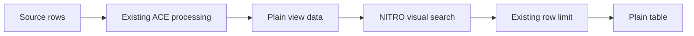

# Global Search: Plain-Mode Visual Filtering

## Summary

Implement global search entirely within DataVis NITRO as a visual filter for plain table output. The query will scan the plain rows already returned by ACE, filter them in memory across visible columns, and pass the matching rows to the existing plain renderer. It will not update the ACE filter specification or rerun grouping, pivoting, aggregation, sorting, or source acquisition as the user types.

This replaces the earlier ACE-backed plan. No DataVis ACE changes or dependency release are required.

## Rationale

Applying each debounced query through ACE would rerun ACE's full `filter -> group -> pivot -> aggregate -> sort` pipeline. On non-trivial datasets, grouping, pivoting, and aggregate calculation can take seconds, making an interactive search field feel unresponsive even when text matching itself is inexpensive.

Plain-mode visual filtering avoids that cost:



Existing per-column filters continue to run through ACE. Global search then narrows the already-filtered plain result in NITRO, so the two mechanisms still compose as an intersection without global search causing additional ACE work.

## Scope Change

The initial release intentionally supports plain output only.

- Plain mode: search input, visual row filtering, result count, clear behavior, and match highlighting are supported.
- Grouped mode: the search control is not shown and grouped data is not visually filtered.
- Pivot mode: the search control is not shown and pivot data is not visually filtered.
- Switching away from plain mode clears the query so no hidden search state survives while the control is unavailable.
- Grouped and pivot support remains a potential later enhancement after a separate performance and product design review.

The original ticket acceptance criteria and testing language should be updated to mark grouped and pivot search as deferred before implementation is considered complete.

## Goals

- Search every row currently present in the plain ACE view, not only the first rendered batch.
- Search across currently visible columns only.
- Match case-insensitive substrings against displayed cell text.
- Compose with active per-column filters without changing their ACE filter specification.
- Avoid source refresh, ACE filtering, grouping, pivoting, aggregate calculation, and sorting when the query changes.
- Highlight matching text in visible plain cells.
- Show and announce the number of visually matched rows.
- Clear visual search without clearing active per-column filters.
- Keep a 5K-row plain dataset responsive while typing.

## Non-Goals

- Searching grouped or pivot output.
- Recomputing groups, pivots, totals, or aggregates from visually matched rows.
- Changing the ACE row count, work information, filter state, or preferences.
- Changing CSV export, clipboard export, source operations, or external consumers of the ACE view.
- Searching hidden columns.
- Fuzzy matching or regular-expression syntax.
- Server-side search or predicate pushdown.
- Saving the query in perspectives or preferences.
- Adding a second search entry point to the title bar or minimal menu.
- Rewriting arbitrary custom React cell trees to highlight substrings.

## Visual-Only Semantics

Global search changes only the rows passed to `PlainTable`.

- `viewState.data` remains the authoritative ACE result.
- `view.getFilter()` and the current per-column `filterSpec` remain unchanged.
- `viewState.workInfo`, ACE row counts, groups, pivots, aggregates, and totals remain unchanged.
- CSV export and clipboard copy continue to use the full ACE result and are not narrowed by visual search.
- Refresh and sort behavior continue to be owned by ACE. When ACE returns a new plain result, the active visual search is reapplied locally.
- Row selection and table operations act only on rows currently passed to the plain renderer, following existing rendered-row behavior.

This distinction must be documented in the public API and reflected in tests so visual search is not mistaken for a data transformation.

## Data Flow

`DataGrid` currently limits plain data before passing it to `TableRenderer`. Global search must be inserted before that limit:

```ts
const visuallyFilteredViewData = filterPlainViewData(
  viewState.data,
  appliedGlobalSearchQuery,
  visibleSearchColumns,
  searchTextIndex,
);

const limitedViewData = limitPlainViewData(
  visuallyFilteredViewData,
  visibleRowCount,
);
```

Required ordering:

1. ACE returns the current plain result, including any active column filters and sort.
2. NITRO builds or reuses searchable display text for those rows.
3. NITRO visually filters the full plain result.
4. NITRO calculates the visual result count.
5. NITRO applies the existing `visibleRowCount` limit to the matching rows.
6. `TableRenderer` receives the limited visual result.

This ordering ensures a query can find a match after the first 100 rows without rendering all rows into the DOM.

## Search Control

Add one `GlobalSearchControl` to `GridToolbar` and render it only when `dataMode === 'plain'`.

The control contains:

- A Lucide search icon.
- An `Input` using `GRID.OMNIFILTER.ARIA_LABEL` and `GRID.OMNIFILTER.PLACEHOLDER`.
- A conditional icon-only clear button using `GRID.OMNIFILTER.CLEAR`.
- A visible localized result count.
- A polite, atomic live region for result announcements.

Interaction behavior:

- The input value updates immediately.
- Visual filtering uses a 100 ms trailing debounce with no new dependency.
- Escape clears the query and keeps focus in the input.
- The clear button removes only global search and retains active column filters.
- The title-bar Clear Filter action clears both the visual query and active column filters.
- Tab and Shift+Tab follow normal DOM order.
- Enter does not submit or reload the page.
- Leaving plain mode clears the query before the grouped or pivot renderer appears.
- Returning to plain mode starts unfiltered.

## Search Semantics

Search rows across fields represented by visible `columnConfigs`.

For each cell:

1. Use `TableColumn.getSearchText(value, row, column)` when supplied.
2. Otherwise use `formatCellValue` with the column type, current locale, and active date-format preset.
3. Normalize the resulting text and query with locale-aware lowercasing.
4. Match by substring inclusion.

Whitespace behavior:

- Trim leading and trailing query whitespace.
- Treat an empty or whitespace-only query as inactive.
- Preserve internal whitespace as typed.

Custom formatter behavior:

- Add an optional `getSearchText` callback to `TableColumn`.
- Consumers with custom React `formatCell` output use this callback when exact display-text matching is required.
- Without the callback, custom cells fall back to the built-in formatted value.
- Document that fallback text may differ from custom JSX output.

## Shared Formatting State

`PlainTable` currently owns per-column date-format overrides. `DataGrid` cannot match the displayed date text while that state is private to the renderer.

Move plain date-format state to `DataGrid` and pass it through `TableRenderer` to `PlainTable`. This creates one display-text source for visual search, plain rendering, highlighting, and plain CSV formatting where applicable.

Changing a date format must rebuild the visual search index and immediately reapply an active query. It must not call any ACE setter or request new view data.

## Search Index and Performance

Avoid formatting every cell after every keystroke.

Add a focused search utility that derives one normalized searchable string per row from the visible columns. Cache row text in a `WeakMap` keyed by the decoded row object.

The cache lifetime is tied to a configuration signature containing:

- Visible field names and order.
- Locale.
- Date-format presets.
- Column type information.
- `getSearchText` callback identities.
- The current `viewState.data` identity.

Behavior:

- Source-data or search-configuration changes create a fresh cache.
- The first active query may populate the cache lazily.
- Query-only changes scan cached normalized strings without reformatting cells.
- A 5K-row query performs only local string checks and a React state update.
- No query change calls `view.setFilter()`, `view.getData()`, `view.refresh()`, or any group, pivot, aggregate, or sort method.

If local filtering still produces a long task, consider building or scanning the index in chunks or using `startTransition` so input updates remain responsive. Do not route the query through ACE as a performance fallback.

## State and Lifecycle

`DataGrid` owns:

- `globalSearchQuery`: the immediate input value.
- `appliedGlobalSearchQuery`: the trimmed query used after debounce.
- Shared plain-mode date formats.
- The current row-text cache.

When the applied query changes:

- Filter only when `viewState.data.isPlain` is true.
- Reset `visibleRowCount` to the configured row batch size.
- Derive a new visual `ViewData` object containing only matching rows.
- Keep `dataByRowId` synchronized with the matching rows.
- Do not mutate `viewState.data` or its row objects.

When plain view data changes because of an ACE sort, column filter, refresh, or source update:

- Invalidate the row-text cache.
- Reapply the active visual query to the new plain result.
- Preserve the input query while the mode remains plain.

When data mode changes away from plain:

- Cancel any pending debounce timer.
- Clear both raw and applied query state.
- Render grouped or pivot output directly from `viewState.data`.

## Result Count

The search count is a NITRO visual count, not an ACE work count.

- With an active query, show the number of rows in the full visually filtered plain result before row limiting.
- Without an active query, show the number of rows in the current plain ACE result.
- Active per-column filters reduce the ACE result first, so the visual count naturally reflects their intersection with global search.
- Do not use `viewState.workInfo.numRows` as the search result count because it is unchanged by visual filtering.

Render the count with `Intl.NumberFormat(locale)` and the existing `TABLE.ROWS` translation. Use `role="status"`, `aria-live="polite"`, and `aria-atomic="true"`. Announce only the applied debounced result, not every immediate input value.

## Clear Behavior and Filter Status

Keep visual search independent from ACE filtering.

- Search clear sets both query states to empty and restores the current plain ACE result.
- Search clear does not call `view.clearFilter()`.
- Existing per-column filter controls continue to call ACE exactly as they do today.
- The title-bar Clear Filter action clears the visual query and calls the existing ACE clear-filter path.
- `hasActiveFilter` should be true when either an ACE column filter or a non-empty visual query is active, so the title-bar clear-all affordance remains available.
- Clearing all should synchronize the input, filter bar, header filter popups, and rendered rows.

## Highlighting

Add a shared case-insensitive text-splitting helper that returns unmatched text and matched `<mark>` segments.

Built-in cells:

- Highlight every non-overlapping matching substring.
- Use `<mark className="wcdv-search-match">`.
- Preserve original displayed casing.
- Do not use `dangerouslySetInnerHTML`.

Custom React cells:

- Do not traverse or rewrite arbitrary React trees.
- If `getSearchText` indicates a match, add a non-destructive matched-cell class.
- Consumers needing substring-level custom highlighting can implement it inside `formatCell`.

Only `PlainTable` needs highlighting in this phase. Group-detail, group-summary, and pivot renderers remain unchanged.

## Implementation Steps

### Phase 1: Search Utilities

1. Add query normalization, display-text extraction, row indexing, plain `ViewData` filtering, and safe text-highlighting helpers.
2. Add `TableColumn.getSearchText` as an optional backward-compatible callback.
3. Add unit tests for empty queries, case-insensitive matching, visible-column selection, locale behavior, date formats, custom accessors, cache invalidation, `dataByRowId`, stable row order, and markup splitting.

### Phase 2: Shared Plain Display Text

4. Lift date-format state and handlers from `PlainTable` into `DataGrid`.
5. Pass date formats through `TableRenderer` to `PlainTable`.
6. Use the same formatting inputs for search, rendering, highlighting, and export where appropriate.
7. Document custom formatter fallback behavior.

### Phase 3: DataGrid Visual Filtering

8. Add raw and applied query state with a 100 ms trailing debounce.
9. Derive searchable visible columns from `columnConfigs` and `allColumns`.
10. Build or reuse the normalized row-text cache for the full plain ACE result.
11. Compute `visuallyFilteredViewData` without mutating `viewState.data`.
12. Pass `visuallyFilteredViewData` to `limitPlainViewData` so search occurs before the 100-row batch limit.
13. Derive the result count from the full visual result.
14. Reset plain batching after an applied query or plain result change.
15. Preserve and reapply search across plain-mode sort, refresh, source update, and per-column filter changes.
16. Clear search when leaving plain mode or on explicit preference reset.
17. Update title-bar clear-all and active-filter status without changing ACE APIs.

### Phase 4: Toolbar and Plain Rendering

18. Add `GlobalSearchControl` to `GridToolbar` only for plain mode.
19. Wire the existing omnifilter translations, Lucide icons, clear action, and visual result count.
20. Pass the applied query to `PlainTable` through `TableRenderer`.
21. Highlight matching built-in cell text and mark matching custom cells non-destructively.
22. Add scoped light and dark match styles in `src/index.css`.
23. Verify toolbar wrapping, focus visibility, and text fit at desktop and narrow widths.

### Phase 5: Production Coverage and Cleanup

24. Extend the E2E harness with visual query and result-count state only where tests need it.
25. Reuse the `default` scenario for behavior and the existing `large` scenario for 5K-row performance.
26. Add a production `global-search.spec.ts` focused on plain mode.
27. Add explicit grouped and pivot assertions that the control is absent and output is unaffected.
28. Remove `OmnifilterScenario`, its harness route, and its legacy tests after replacement coverage passes.
29. Update the ticket and README to state that this release is plain-mode and visual-only.

## Automated Test Matrix

| Area | Required assertion |
| --- | --- |
| Empty query | All rows in the current plain ACE result remain visible. |
| Whitespace query | Behaves like an empty query. |
| Case | Uppercase and lowercase queries return identical visual rows. |
| Cross-column | Queries match values in different visible columns. |
| Hidden column | A value present only in a hidden column does not match. |
| Visibility change | Hiding or revealing a column rebuilds active visual results without ACE work. |
| Formatted date | Query matches the date string currently displayed. |
| Date-format change | Active search is reapplied locally against the new text. |
| Custom accessor | `getSearchText` controls matching for custom React cells. |
| No accessor | Custom cells fall back to built-in formatted text without altering JSX. |
| No match | Plain table displays no data and announces zero rows. |
| Plain limit | A match after the first 100 ACE rows is found. |
| Stable order | Visual filtering preserves ACE sort order. |
| Column composition | Visual search narrows the current ACE column-filter result. |
| Search clear | Search clears while the ACE column filter remains active. |
| Clear all | Title action clears both visual search and ACE column filters. |
| Refresh | Active search is reapplied locally to refreshed plain data. |
| Sort | Active search is reapplied locally without initiating an extra ACE operation. |
| Mode switch | Leaving plain clears search and grouped/pivot output is unchanged. |
| Highlight | Displayed matching substrings are marked without changing text. |
| Keyboard | Input and clear button follow logical tab order; Escape clears. |
| Live region | Applied visual count is polite, atomic, and localized. |
| Accessibility | Search-active plain grid has no new axe violations. |
| Export | CSV and clipboard remain based on the ACE result, not visual search. |
| No ACE work | Query changes do not call filter, group, pivot, aggregate, sort, refresh, or getData methods. |

## Performance Verification

Measure visual filtering independently from the fixed debounce.

For the existing 5K-row `large` scenario:

- Measure first-query time, including lazy row-text index population.
- Measure a subsequent query using cached normalized row strings.
- Target less than approximately 100 ms for local filtering.
- Use a separate end-to-end ceiling for debounce plus React rendering to avoid flaky CI timing.
- Record calls to the mock view and assert that query changes cause no ACE operations.
- Confirm input updates immediately while the visual result update can be scheduled with `startTransition` if necessary.

If the first query exceeds the target:

1. Profile formatter and index-construction costs.
2. Remove duplicate formatting work.
3. Warm the row-text cache after plain data and column metadata settle.
4. Chunk local index construction or move it to a worker only if profiling justifies the complexity.
5. Do not route the query through ACE or increase debounce merely to hide compute time.

## Relevant Files

| File | Change |
| --- | --- |
| `src/components/DataGrid.tsx` | Own query, debounce, visual filtering, cache lifecycle, result count, date formats, batching order, and clear behavior. |
| `src/components/GridToolbar.tsx` | Render the search control only in plain mode. |
| `src/components/global-search/GlobalSearchControl.tsx` | Accessible input, clear button, and live visual count. |
| `src/components/global-search/search-utils.tsx` | Display-text indexing, plain view filtering, normalization, and highlighting. |
| `src/components/global-search/search-utils.test.tsx` | Unit coverage for visual search and cache behavior. |
| `src/components/table/types.ts` | Add `getSearchText` and shared date/search props. |
| `src/components/table/TableRenderer.tsx` | Propagate the applied query and shared date formats to `PlainTable`. |
| `src/components/table/PlainTable.tsx` | Consume shared date formats and highlight visual matches. |
| `src/components/export-utils.ts` | Consume shared date formats if required while remaining independent of the visual row subset. |
| `src/index.css` | Add scoped light and dark match styles. |
| `src/testing/E2EHarnessApp.tsx` | Expose visual search state and ACE call logs; remove the isolated scenario. |
| `src/testing/LegacyScenarioViews.tsx` | Remove `OmnifilterScenario`. |
| `tests/e2e/helpers.ts` | Add typed visual-search helpers as needed. |
| `tests/e2e/global-search.spec.ts` | Plain behavior, accessibility, no-ACE-work assertions, and performance. |
| `tests/e2e/legacy-scenarios.spec.ts` | Remove the replaced omnifilter assertion. |
| `tests/e2e/legacy-scenarios-expanded.spec.ts` | Remove the replaced clear assertion. |
| `plans/okr/global-search-ticket.textile` | Revise acceptance criteria to plain-mode visual filtering and defer grouped/pivot behavior. |
| `README.md` | Document the visual-only scope, clear semantics, export behavior, and `getSearchText`. |

No changes are required in `datavis-ace`, `package.json`, or `package-lock.json` for this feature.

## Verification Commands

Run focused validation first:

```sh
npm test -- --run src/components/global-search/search-utils.test.tsx
npx playwright test tests/e2e/global-search.spec.ts
```

Then run the complete NITRO checks:

```sh
npm run typecheck
npm run lint
npm test
npm run build
npm run e2e
```

Manual verification:

- Confirm the search control appears in plain mode and is absent in grouped and pivot modes.
- Confirm a query finds rows beyond the first 100-row display batch.
- Confirm per-column filters narrow the base result before visual search.
- Confirm typing and clearing never trigger ACE loading indicators or recomputation.
- Confirm leaving plain mode clears the query and does not alter grouped or pivot output.
- Confirm zero results, focus, live announcements, and highlighting.
- Confirm CSV and clipboard output remain based on the ACE result.
- Confirm desktop and narrow toolbar layouts do not overlap or truncate controls incoherently.

## Decisions

- Keep the feature entirely within NITRO; make no ACE changes.
- Support plain output only in this release.
- Filter the full plain ACE result before applying NITRO's row display limit.
- Treat the feature as visual state rather than a view transformation.
- Preserve ACE sorting and per-column filtering, then visually narrow their result.
- Clear the query when leaving plain mode.
- Count visually matched plain rows locally.
- Keep CSV, clipboard, aggregates, work information, and external view consumers unchanged.
- Search visible columns only and use `TableColumn.getSearchText` for exact custom display semantics.
- Highlight only plain cells in this phase.