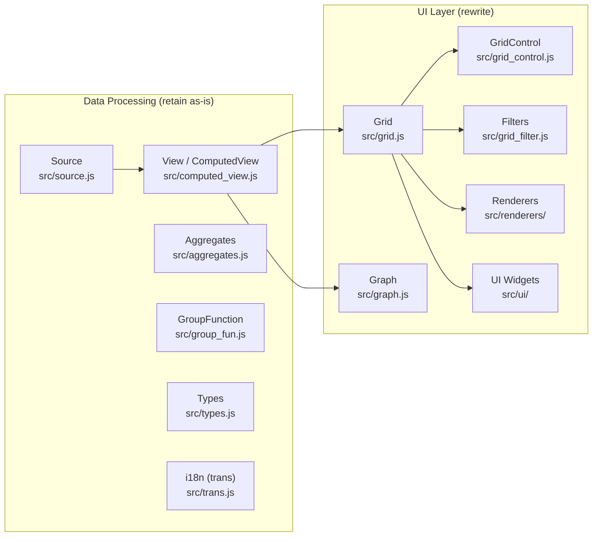

# WC DataVis v0 Rewrite Plan — Align to UI.mieweb.org

> **Status:** Phase 0, 1, 2 & 3 Complete  
> **Date:** 2026-03-04  
> **Goal:** Replace all legacy/third-party UI widgets with `@mieweb/ui` (React + Tailwind) components while retaining the existing data-processing libraries unchanged.

---

## 1. UI Surface Inventory

The current WC DataVis library exposes the following user-facing screens/flows. Each is built entirely with jQuery + jQuery UI + bespoke `jQuery.fn` extensions.

| # | Screen / Flow | Entry Point | Description |
|---|--------------|-------------|-------------|
| A | **Grid View** | `src/grid.js` | Primary data table. Title bar, toolbar, control panel, data table, optional slider. |
| B | **Graph View** | `src/graph.js` | Chart display area. Title bar, toolbar, rendering canvas (Chart.js / Google / Gantt). |
| C | **Grid Toolbar** | `src/ui/toolbars/grid.js` | Row-mode toggle, group-mode toggle, column config, template editor, perspective controls, CSV export, auto-show-more, show-all. 884 lines of jQuery DOM construction. |
| D | **Control Panel** | `src/grid_control.js` | Drag-and-drop panes for group fields, pivot fields, aggregate fields, filter fields. Resizable container. |
| E | **Filter Panel** | `src/grid_filter.js` + `src/ui/grid_filter.js` + `src/ui/filters/date.js` | Dynamic per-column filters: text, dropdown (SumoSelect), number, checkbox, tri-bool, date single, date range. Operator selector per filter. |
| F | **Column Config Dialog** | `src/ui/windows/col_config.js` | Sortable table of columns — rename, pin, hide, allow-HTML, custom CSS, move up/down. jQuery UI dialog. |
| G | **Template Editor Dialog** | `src/ui/templates.js` | Tabbed dialog (plain / grouped / pivot) with textareas for Handlebars/Squirrelly templates. jQuery UI dialog + tabs. |
| H | **Debug Dialog** | `src/ui/windows/debug.js` | Tabs + accordion showing source params, type info, view config, grid columns, prefs state. Uses `json-formatter-js`. |
| I | **Grid Table Options Dialog** | `src/ui/windows/grid_table_opts.js` | Checkbox + textarea for display-format customisation (cell template). jQuery UI dialog. |
| J | **Group Function Window** | `src/group_fun_win.js` | Dialog for editing group-function parameters. jQuery UI dialog. |
| K | **Perspective Manager** | `src/grid.js` (L1250) + `src/prefs.js` | Dialog for create/switch/delete perspectives. jQuery UI dialog. |
| L | **Slider (Row Detail)** | `src/ui/slider.js` | Slide-in panel from right side showing row detail content. Custom CSS animation. |
| M | **Operations Palette** | `src/operations_palette.js` | Inline toolbar of action buttons (icons) for row-level or cell-level operations. |
| N | **Table Renderer** | `src/renderers/grid/table.js` + `table/` sub-modules | Data table with column resize, column reorder (drag), sticky headers, context menus, sort icons, progress bar, block-UI overlay. ~2300 lines. |

---

## 2. Third-Party UI Dependencies to Remove/Replace

| Dependency | npm Package | Where Used | Removal Strategy |
|-----------|-------------|-----------|-----------------|
| **jQuery** | `jquery` | *Everywhere* — DOM backbone, event bus | Eliminate; React owns the DOM. Thin adapter for data-processing code that fires jQuery events today. |
| **jQuery UI** | `jquery-ui` | `dialog()` ×8 files, `tabs()` ×2, `accordion()` ×1, `sortable()` ×3, `draggable()` ×2, `droppable()` ×3, `resizable()` ×2, `tooltip()` ×5, `progressbar()` ×1, `effect('highlight')` ×1 | Replace each widget with the mapped `@mieweb/ui` component (see §3). |
| **SumoSelect** | `sumoselect` (fork) | `src/grid_filter.js` — multi-select filter dropdowns | Replace with `@mieweb/ui` `<Select>` (multi-select mode). |
| **flatpickr** | `flatpickr` | `src/grid_filter.js` — single & range date pickers | Replace with `@mieweb/ui` `<DateInput>` and `<DateRangePicker>`. |
| **jquery-contextmenu** | `jquery-contextmenu` | `src/renderers/grid/table.js` — column header right-click menus | Replace with `@mieweb/ui` `<Dropdown>` (context-menu variant). |
| **block-ui** | `block-ui` | `src/util/misc.js`, `grid/table.js` — blocking overlay during load | Replace with `@mieweb/ui` `<Spinner>` / `<Skeleton>` / `<LoadingPage>` overlay pattern. |
| **json-formatter-js** | `json-formatter-js` (fork) | `src/ui/windows/debug.js`, `src/types.js`, `src/util/ordmap.js` | Use a lightweight React JSON viewer or simple `<pre>` formatting. |
| **Font Awesome (jQuery helper)** | n/a (inline `fontAwesome()`) | 15+ files, 90+ call sites | Replace with `@mieweb/ui` `<Icons>` system or direct SVG imports; update icon names to FA 6 / Lucide where applicable. |
| **Underscore** | `underscore` | Utility functions across all files | Retain in data-processing; new UI code uses native JS / lodash-es if needed. |

### Dependencies to **Retain** (data-processing / rendering engines)

| Dependency | Reason |
|-----------|--------|
| `chart.js` | Graph rendering engine — not UI chrome |
| `svelte-gantt` | Gantt rendering engine — evaluating keep vs. replace separately |
| `handlebars` / `squirrelly` | Template renderers for handlebars/squirrelly grid modes |
| `moment` / `numeral` / `bignumber.js` / `sprintf-js` | Data formatting — no UI surface |
| `papaparse` | CSV parsing — no UI surface |
| `css.escape` | Utility — minimal |

---

## 3. Component Mapping Table

### 3a. Widget-Level Mapping

| Current Widget | jQuery / 3rd-Party API | `@mieweb/ui` Replacement | Notes |
|---------------|----------------------|--------------------------|-------|
| Modal dialogs | `jQuery.dialog()` | `<Modal>` | 8 dialog call sites. `@mieweb/ui` Modal supports header/footer/close/backdrop. |
| Tabs | `jQuery.tabs()` | `<Tabs>` | Template editor, debug window. |
| Accordion | `jQuery.accordion()` | `<ServiceAccordion>` (or custom collapsible via `<Card>` sections) | Debug window only. |
| Sortable list | `jQuery.sortable()` | **Gap** — need a drag-and-drop sortable list. Use `@dnd-kit/sortable` or build a thin wrapper. | Column config reorder, group/pivot field lists. |
| Draggable field | `jQuery.draggable()` + `jQuery.droppable()` | **Gap** — DnD for control panel fields. Use `@dnd-kit/core`. | Group/pivot/aggregate control panel. |
| Resizable panel | `jQuery.resizable()` | **Gap** — CSS `resize` or `react-resizable`. Evaluate if needed. | Control panel divider only. |
| Tooltip | `jQuery.tooltip()` | `<Tooltip>` | Direct replacement. |
| Progress bar | `jQuery.progressbar()` | `<Progress>` | Data-loading indicator. |
| SumoSelect dropdown | `$(sel).SumoSelect()` | `<Select>` (multi-select mode) | Filter dropdowns. Needs `multiple`, search, select-all. |
| Flatpickr date picker | `flatpickr()` | `<DateInput>` + `<DateRangePicker>` | Single date & date-range filters. |
| Context menu | `$.contextMenu()` | `<Dropdown>` (right-click triggered) | Table header sort/filter menu. |
| Block UI overlay | `$.blockUI()` | `<Spinner>` overlay or `<Skeleton>` | Loading blocker. |
| Icon checkbox | `_makeIconCheckbox()` | `<Checkbox>` + icon label or `<Switch>` | Column config toggles. |
| Radio buttons | `makeRadioButtons()` | `<Radio>` group | Row mode, group mode. |
| Toggle checkbox | `makeToggleCheckbox()` | `<Switch>` or `<Checkbox>` | Auto-show-more, show-total-row, etc. |
| Operation buttons | `makeOperationButton()` | `<Button>` (icon variant) | Operations palette. |
| Slider (row detail) | Custom CSS `.wcdv-slider` | `<Sidebar>` or `<Modal>` (slide-over variant) or `<Slider>` | Detail panel from right edge. `@mieweb/ui` has a `<Slider>` and `<Sidebar>` — evaluate fit. |
| JSON formatter | `JSONFormatter` | `<pre>` + syntax highlighting or a small React JSON tree | Debug window. |

### 3b. Composite Screen Mapping

| Screen | Current | Proposed `@mieweb/ui` Composition |
|--------|---------|----------------------------------|
| **Grid Title Bar** | jQuery `
` with inline spans/buttons | `<PageHeader>` or `<Card.Header>` with `<Button>` icons, `<Spinner>`, `<Dropdown>` gear menu |
| **Grid Toolbar** | `ToolbarSection` subclasses (jQuery DOM) | Horizontal `
` using `<Button>`, `<Radio>`, `<Switch>`, `<Dropdown>`, `<Tooltip>` |
| **Control Panel** | jQuery droppable/sortable zones | React DnD zones (`@dnd-kit`) inside a collapsible `<Card>` |
| **Filter Row** | Per-column filter widgets inline in `<thead>` | React filter-cell components using `<Input>`, `<Select>`, `<DateInput>`, `<Checkbox>` |
| **Column Config** | jQuery UI dialog + sortable table | `<Modal>` containing a `<Table>` with drag-handles (DnD), `<Checkbox>`, `<Switch>`, `<Button>` |
| **Template Editor** | jQuery UI dialog + tabs + textareas | `<Modal>` + `<Tabs>` + `<Textarea>` |
| **Debug Window** | jQuery UI dialog + tabs + accordion + JSON | `<Modal>` + `<Tabs>` + collapsible `<Card>` sections + `<pre>` |
| **Perspective Mgmt** | jQuery UI dialog + list | `<Modal>` + `<Select>` / list + `<Button>` |
| **Row Detail Slider** | Custom sliding `
` | `<Sidebar>` (overlay mode) or `<Slider>` |
| **Graph View** | jQuery wrapper around Chart.js canvas | React wrapper component; toolbar uses `<Switch>`, `<Dropdown>`, `<Button>` |

### 3c. Identified Gaps in `@mieweb/ui`

| Gap | Description | Recommended Action |
|-----|------------|-------------------|
| **Sortable / DnD list** | No built-in drag-and-drop list/table reordering | Add `@dnd-kit/sortable` as a peer dependency or build a `<SortableList>` component in `@mieweb/ui`. |
| **Drag-and-drop zones** | No drop-zone for field pills (group/pivot/aggregate panel) | Build with `@dnd-kit/core` in the DataVis wrapper. Consider upstreaming a `<DragDropZone>` to `@mieweb/ui`. |
| **Resizable split pane** | No resizable panel divider | Use CSS `resize: vertical` or a lightweight library. Low priority — evaluate if needed. |
| **Multi-select with search** | `<Select>` exists but verify it supports `multiple`, search, select-all like SumoSelect | Verify / extend `<Select>` component. |
| **AG Grid integration** | `@mieweb/ui` already has an `AGGrid` entry point — could replace the custom table renderer entirely | Evaluate in Phase 2. |
| **Date range picker** | `<DateRangePicker>` exists — verify it covers all operators (on/before/after/between/every/current/last) | May need a custom operator+picker composite. |
| **Context menu trigger** | `<Dropdown>` is click-triggered; needs right-click support | Extend `<Dropdown>` or add a `<ContextMenu>` variant. |

---

## 4. Data-Processing Boundary

### Architecture Today

### Proposed Boundary

```mermaid
graph LR
    subgraph DataCore["@mieweb/wcdatavis/core (unchanged JS)"]
        Source
        View["View / ComputedView"]
        Aggregates
        GroupFn["GroupFunction"]
        Types
        Trans["trans()"]
        Prefs["Prefs / PrefsBackend"]
    end

    subgraph Adapter["Thin Adapter Layer (new)"]
        EventBridge["EventBridge<br/>jQuery events → React callbacks"]
        DataHooks["useSource(), useView()<br/>React hooks wrapping core"]
        TypeAdapter["Type formatting helpers"]
    end

    subgraph ReactUI["@mieweb/wcdatavis/ui (new React)"]
        DataGrid["DataGrid component"]
        DataGraph["DataGraph component"]
        FilterBar["FilterBar component"]
        ControlPanel["ControlPanel component"]
        Toolbar["Toolbar component"]
        Dialogs["Modal dialogs"]
    end

    DataCore --> Adapter
    Adapter --> ReactUI

    classDef core fill:#e8f5e9,stroke:#2e7d32
    classDef adapter fill:#fff3e0,stroke:#e65100
    classDef ui fill:#e3f2fd,stroke:#1565c0
    class Source,View,Aggregates,GroupFn,Types,Trans,Prefs core
    class EventBridge,DataHooks,TypeAdapter adapter
    class DataGrid,DataGraph,FilterBar,ControlPanel,Toolbar,Dialogs ui
```

### Adapter Rules

1. **No jQuery in new UI code.** All DOM is React-owned.
2. **Event bridge:** The existing `mixinEventHandling` fires events on JS objects (not DOM). Create a thin `EventBridge` that converts these to React-friendly callback props or a pub/sub hook (`useDataVisEvent`).
3. **Data hooks:** `useSource(spec)` and `useView(source, config)` wrap `Source` and `ComputedView` construction and expose reactive state.
4. **Type formatting:** Reuse `types.js` formatting functions directly — they return strings/HTML. For React, convert HTML-returning formatters to return React elements where needed.
5. **i18n:** Reuse `trans()` directly. Long-term, align with `@mieweb/ui`'s `<LanguageSelector>` / i18n approach.

---

## 5. Phased Roadmap

### Phase 0 — Scaffold & Adapter ✅

- [x] Add `react`, `react-dom`, `@mieweb/ui` as dependencies
- [x] Set up Vite dual-build (existing IIFE bundle + new React entry point)
- [x] Create adapter layer: `EventBridge`, `useSource()`, `useView()` hooks
- [x] Verify data core imports work without jQuery side-effects in the React path
- [x] Set up Storybook for DataVis component development

### Phase 1 — Grid Shell ✅

- [x] `<DataGrid>` React component: title bar, toolbar, content area
- [x] Port toolbar: `<Button>`, `<Radio>`, `<Switch>`, `<Dropdown>`, `<Tooltip>`
- [x] Port slider / row-detail panel using `<Sidebar>` or `<Slider>`
- [x] Port operations palette using `<Button>` icon variants
- [x] Port block-UI overlay → `<Spinner>` / loading state

### Phase 2 — Filters & Control Panel ✅

- [x] `<FilterBar>` component replacing `GridFilterSet`
- [x] Individual filter components: `<StringFilter>`, `<NumberFilter>`, `<DateFilter>`, `<BooleanFilter>`
- [x] Replace SumoSelect → custom multi-select dropdown with search, select-all
- [x] Replace flatpickr → native date/datetime-local inputs with operator-based UI
- [x] `<ControlPanel>` with `@dnd-kit` for group/pivot/aggregate drag-and-drop

### Phase 3 — Dialogs ✅

- [x] Column Config → `<Modal>` + sortable `<Table>` + `<Checkbox>` / `<Switch>`
- [x] Template Editor → `<Modal>` + `<Tabs>` + `<Textarea>`
- [x] Debug Window → `<Modal>` + `<Tabs>` + collapsible sections
- [x] Grid Table Options → `<Modal>` + `<Checkbox>` + `<Textarea>`
- [x] Group Function Window → `<Modal>` + form inputs
- [x] Perspective Manager → `<Modal>` + `<Select>` + `<Button>`

### Phase 4 — Table Renderer (3–4 weeks)

- [ ] React-based table renderer (or evaluate `AGGrid` via `@mieweb/ui/ag-grid`)
- [ ] Column resize (CSS-based or library)
- [ ] Column reorder (DnD)
- [ ] Sticky headers
- [ ] Context menu → `<Dropdown>` right-click
- [ ] Sort icons, filter indicators
- [ ] Group detail / summary / pivot sub-renderers
- [ ] Progress bar → `<Progress>`

### Phase 5 — Graph Shell (1–2 weeks)

- [ ] `<DataGraph>` React component wrapping Chart.js
- [ ] Toolbar: axis toggles, stack toggle, export
- [ ] Evaluate Gantt renderer in React context

### Phase 6 — Polish & Integration (1–2 weeks)

- [ ] Theming via `<ThemeProvider>` + brand CSS
- [ ] Dark mode support
- [ ] Accessibility audit (ARIA labels, keyboard nav, focus management)
- [ ] i18n alignment with `trans()` + `<LanguageSelector>`
- [ ] Performance testing with large datasets
- [ ] Documentation update

**Estimated total: 11–18 weeks** (one developer, conservative)

---

## 6. Risk List

| Risk | Impact | Likelihood | Mitigation |
|------|--------|------------|------------|
| **jQuery event coupling** — data-processing code fires/listens to jQuery events internally | High | Medium | Audit all `mixinEventHandling` / `.on()` / `.trigger()` usage in core. Build EventBridge early (Phase 0). |
| **SumoSelect feature gap** — `@mieweb/ui` `<Select>` may not support all SumoSelect features (search, select-all, option grouping, custom rendering) | Medium | Medium | Spike on `<Select>` capabilities early. Extend or wrap if needed. |
| **DnD complexity** — control panel drag-and-drop (group/pivot/aggregate) is deeply integrated with jQuery UI | High | High | Defer control panel to Phase 2; use `@dnd-kit` which is well-supported. Accept some UX differences in v0. |
| **Table renderer performance** — current table is heavily optimised with DOM recycling, manual scroll, limit feature | High | Medium | Phase 4 can start with a simple React table and iterate. Evaluate AG Grid (`@mieweb/ui/ag-grid`) early as an alternative. |
| **Handlebars/Squirrelly renderers** — these grid renderers generate raw HTML from templates | Medium | Low | Can wrap in `dangerouslySetInnerHTML` initially; long-term migrate to React-native templating. |
| **Global jQuery requirement** — `global-jquery.js` hack for plugin loading | Low | Low | Not needed in React path; only relevant if legacy IIFE must coexist. |
| **Missing `@mieweb/ui` components** (DnD, context menu, resizable) | Medium | High | Plan to contribute upstream or use thin 3rd-party wrappers. |
| **Dual-build coexistence** — legacy consumers still need the jQuery bundle | Medium | Medium | Maintain parallel builds during transition; deprecate legacy path after v0 stabilises. |
| **Type system bridging** — `types.js` sometimes returns jQuery/HTML elements | Low | Medium | Add React-friendly overloads that return strings or React elements. |
| **Moment.js** — `@mieweb/ui` uses Luxon; DataVis uses Moment | Low | Medium | Coexist initially. Long-term migrate data core to Luxon. |
